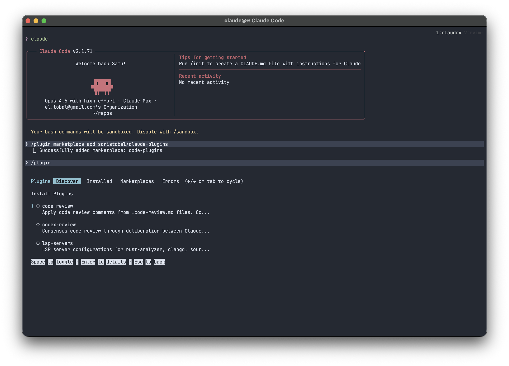

A marketplace of Claude Code plugins for code review, developer tooling, and AI-powered workflows.

| Plugin | Description |
|--------|-------------|
| **codex-review** | Consensus code review through deliberation between Claude and Codex. Both models independently review code, then debate findings until they agree. See [evaluation results](plugins/codex-review/evaluation/results.md).<br>Requires [codex](https://github.com/openai/codex) installed. |
| **code-review** | Apply code review comments from `.code-review.md` files.<br>Companion skill for [scristobal/code-review.nvim](https://github.com/scristobal/code-review.nvim). |
| **lsp-servers** | LSP server configurations for rust-analyzer, clangd, sourcekit-lsp, kotlin-lsp, lua-language-server, ty, tsgo, and gleam, that mimic my [dotfiles](https://github.com/scristobal/dotfiles) Neovim configs.<br>Does not try install anything. |

From within a Claude Code session:

```
/plugin marketplace add scristobal/claude-plugins
```

Then browse and install plugins with `/plugin` > Discover.



